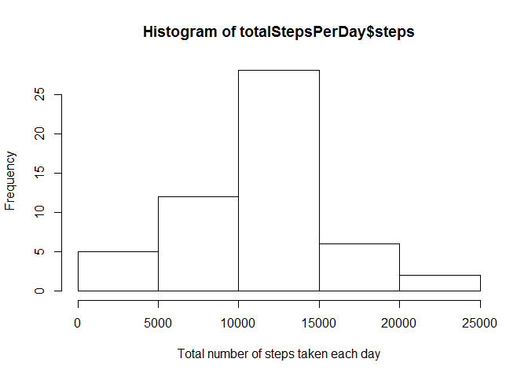
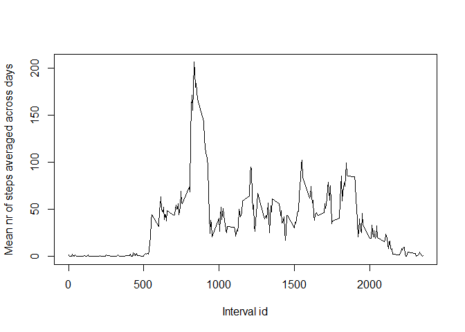
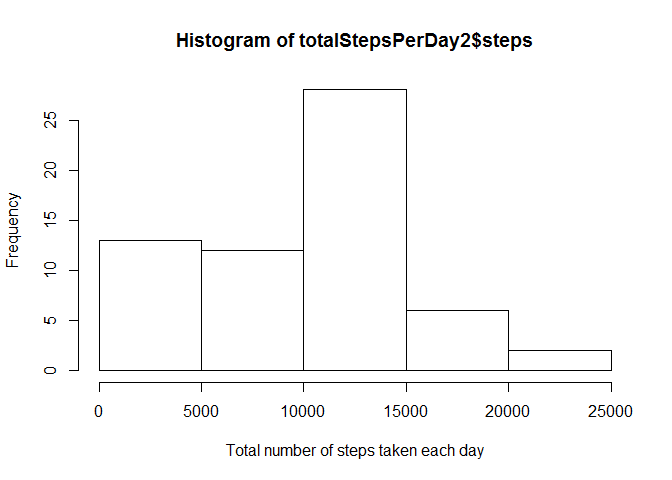
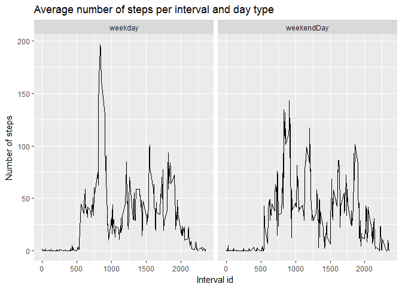

# Reproducible Research: Peer Assessment 1
## Loading and preprocessing the data
The first step is to read the file containing the data. By a first look at the file, it contains valid names for the columns and the separator is the character ",". Thus we use this information to read a clean table.


```r
rawData <- read.csv("./activity/activity.csv",header = TRUE,sep = ",",stringsAsFactors = FALSE)
summary(rawData)
```

```
##      steps            date              interval     
##  Min.   :  0.00   Length:17568       Min.   :   0.0  
##  1st Qu.:  0.00   Class :character   1st Qu.: 588.8  
##  Median :  0.00   Mode  :character   Median :1177.5  
##  Mean   : 37.38                      Mean   :1177.5  
##  3rd Qu.: 12.00                      3rd Qu.:1766.2  
##  Max.   :806.00                      Max.   :2355.0  
##  NA's   :2304
```
By having a quick look at the dataset we noticed two things. First it contains a lot of "NA" values, which are not valid to make the following computations, so we remove them.

```r
activityData <- rawData[complete.cases(rawData),]
summary(activityData)
```

```
##      steps            date              interval     
##  Min.   :  0.00   Length:15264       Min.   :   0.0  
##  1st Qu.:  0.00   Class :character   1st Qu.: 588.8  
##  Median :  0.00   Mode  :character   Median :1177.5  
##  Mean   : 37.38                      Mean   :1177.5  
##  3rd Qu.: 12.00                      3rd Qu.:1766.2  
##  Max.   :806.00                      Max.   :2355.0
```
If everything is done correctly the lenght of this data set should be 17568-2304.
And second, the dates are of "character" class, so we prefer to have them as a "Date" format (year, month and day). Then we do the transformation on the specific column.

```r
activityData$date <- as.POSIXct(activityData$date,format = "%Y-%m-%d")
```
 
## What is mean total number of steps taken per day?
As a requirement for this task we need to calculate first the total number of steps taken per day. For that we use the following code:


```r
library(dplyr)
```

```
## 
## Attaching package: 'dplyr'
```

```
## The following objects are masked from 'package:stats':
## 
##     filter, lag
```

```
## The following objects are masked from 'package:base':
## 
##     intersect, setdiff, setequal, union
```

```r
totalStepsPerDay <- aggregate(steps ~ date, activityData, sum) 
```
Then we make a histogram of the total number of steps taken each day, computed just previously.


```r
hist(totalStepsPerDay$steps,xlab = "Total number of steps taken each day")
```

<!-- -->

To calculate and to report the mean and the median of the total number of steps taken per day, we just need to call the summary command which makes a complete report of the desired values.


```r
summary(totalStepsPerDay$steps)
```

```
##    Min. 1st Qu.  Median    Mean 3rd Qu.    Max. 
##      41    8841   10760   10770   13290   21190
```


## What is the average daily activity pattern?
Next task is to plot a time series graphic of the 5-minute interval and the average number of steps taken, averaged across all days. In this case it is important to group the steps information by the intervals


```r
meanStepsByInterval <- aggregate(steps ~ interval,activityData,mean)
with(meanStepsByInterval,plot(interval,steps,ylab = "Mean nr of steps averaged across days", xlab="Interval id", type = "l"))
```

<!-- -->

Now we are asked to find the maximum point of the graphic, which corresponds with the maximum number of average steps.


```r
maxNrSteps <- max(meanStepsByInterval$steps)
meanStepsByInterval[meanStepsByInterval$steps==maxNrSteps,]
```

```
##     interval    steps
## 104      835 206.1698
```

Thus we can see here the 5-minute interval that, on average, contains the maximum number of steps.

## Imputing missing values
When we checked the summary of the raw data we already saw the number of NA cases found. However we can also use a special command to tell us exactly this number on the raw dataset.


```r
sum(is.na(rawData$steps))
```

```
## [1] 2304
```

We are required to devise a strategy for filling in all of the missing values in the dataset. The strategy does not need to be sophisticated. For example, one could use the mean/median for that day, or the mean for that 5-minute interval, etc. We decided to take the mean nr of steps per day as a good replacement for a NA. That is why we built the function "getMeanSteps".


```r
meanStepsPerDay <- aggregate(steps ~ date, activityData, mean)
# we convert the date column of the raw dataset into the right format
rawData$date <- as.POSIXct(rawData$date,format = "%Y-%m-%d")
# we need a function to get the mean value for a specific date, and if the date is not found in the dataset,
# we return 0. day must be in a POSIXct format
getMeanSteps <- function(day){
    found <- meanStepsPerDay[meanStepsPerDay$date==day,"steps"]
    if(length(found) > 0){
        return(found)
    }
    return (0)
}
replaceNASteps <- function(raw){
    output <- raw
    for(i in 1:nrow(raw)){
        if(is.na(raw[i,]$steps)){
            output[i,]$steps <- getMeanSteps(raw[i,"date"])
        }
    }
    return(output)
}
filledData <- replaceNASteps(rawData)
```

The result of applying the funtion "replaceNASteps" to the rawData dataset is the new dataset where there are not a single NA value since they were all replaced by the day-mean value as explained before.

Now we are going to repeat the same calculations that we made for the activityData dataset.


```r
totalStepsPerDay2 <- aggregate(steps ~ date, filledData, sum) 
hist(totalStepsPerDay2$steps,xlab = "Total number of steps taken each day")
```

<!-- -->

```r
summary(totalStepsPerDay2$steps)
```

```
##    Min. 1st Qu.  Median    Mean 3rd Qu.    Max. 
##       0    6778   10400    9354   12810   21190
```

We can compare the mean and median results from totalStepsPerDay and totalStepsPerDay2.

```r
mean(totalStepsPerDay$steps)-mean(totalStepsPerDay2$steps)
```

```
## [1] 1411.959
```

```r
median(totalStepsPerDay$steps)-median(totalStepsPerDay2$steps)
```

```
## [1] 370
```

With the filled dataset both values,the mean and the median, were decremented since we are increasing the number of cases by more than 2000 rows.

## Are there differences in activity patterns between weekdays and weekends?
For this part we need to divide the dates in two groups: weekday or weekendDay.
We create a new factor variable in the dataset with two levels -- "weekday" and "weekendDay" indicating whether a given date is a weekday or weekend day.


```r
# we need the Date format 
filledData$date <- as.Date(filledData$date)
# and a reference vector of weekdays
weekdays <- c('Monday', 'Tuesday', 'Wednesday', 'Thursday', 'Friday')
# now we add a new column to the dataset with the dayType factor
filledData$dayType <- factor((weekdays(filledData$date) %in% weekdays), 
         levels=c(TRUE,FALSE), labels=c('weekday','weekendDay'))
```
Finally we need to make a panel plot containing a time series plot of the 5-minute interval and the average number of steps taken, averaged across all weekday days or weekend days. We used the ggplot2 system which gives a final professional result.


```r
meanStepsByIntervalAndDay <- aggregate(steps ~ interval + dayType,filledData,mean)
library(ggplot2)
qplot(interval,steps,data=meanStepsByIntervalAndDay,facets = .~dayType,geom = "line")+ labs(x="Interval id")+labs(y= "Number of steps")+labs(title="Average number of steps per interval and day type")
```

<!-- -->
